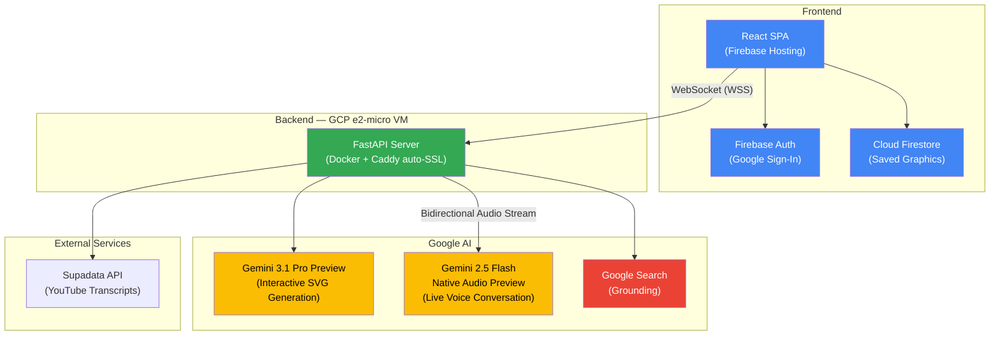
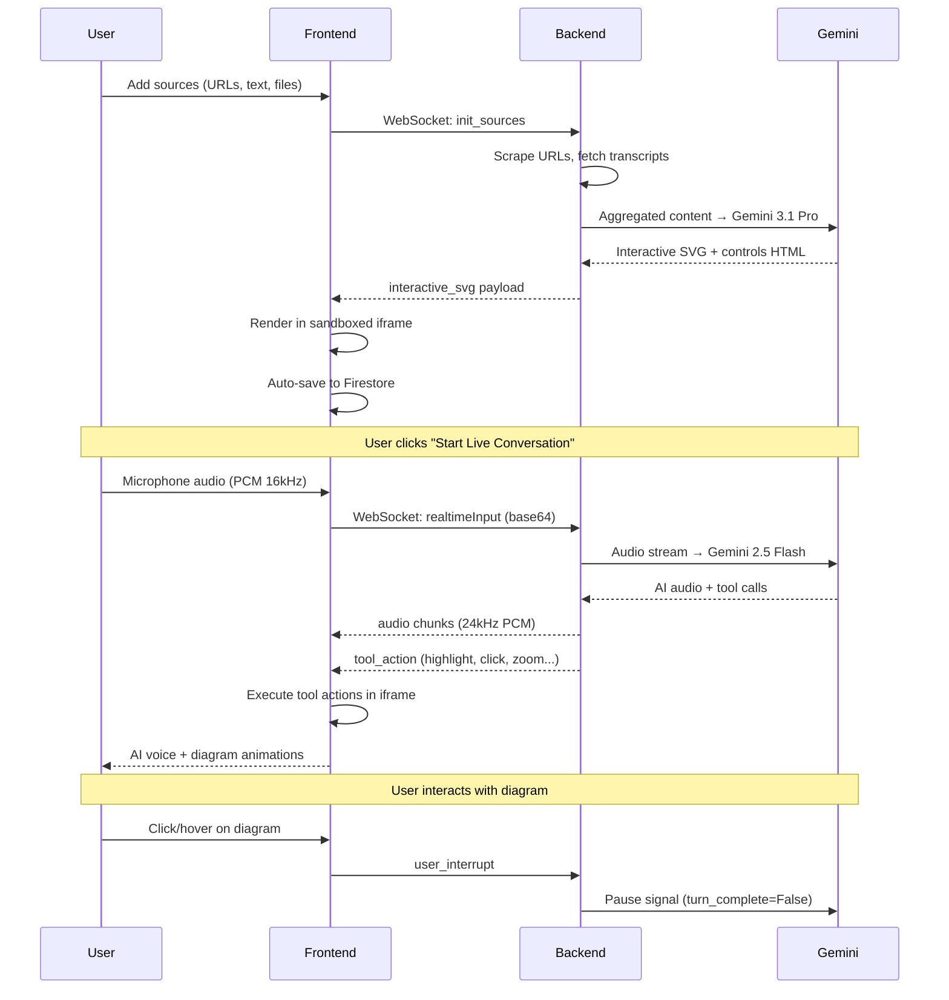

# Narluga

**Transform any content into interactive, animated diagrams you can talk to.**

Narluga turns websites, YouTube videos, text notes, and uploaded files into rich interactive SVG graphics — then lets you have a real-time voice conversation with an AI that explains and manipulates the diagram as you speak.

Built for the **Live Agents** category of the [Gemini Live Agent Challenge](https://geminiliveagentchallenge.devpost.com).

## Demo

> **Live app**: [https://narluga.web.app](https://narluga.web.app)

## Try It (Testing Instructions for Judges)

**Option A — Use the live app (recommended):**

1. Go to [narluga.web.app](https://narluga.web.app)
2. Browse the **Examples** gallery to see pre-built interactive diagrams instantly
3. To generate your own:
   - Paste a URL (e.g. a Wikipedia article) or type a short note in the sidebar
   - Click **Generate** and wait a couple minutes for the diagram to appear
4. Click **Start Live Conversation** (requires microphone permission)
   - Listen to the AI explain the diagram — watch it highlight elements and toggle animations as it speaks
   - Try interrupting by clicking a control mid-conversation — the AI will pause and adapt
   - Ask something beyond the source material (e.g. "Can you find out more about X?") to see Google Search grounding in action
5. Click **End Conversation** when done

**Option B — Run locally:**

Follow the [Getting Started](#getting-started) instructions below. Set `DISABLE_AUTH=true` in `backend/.env` to skip authentication.

## How It Works

1. **Add sources** — Paste URLs (websites, YouTube), type notes, upload files, or run a web search
2. **Generate** — Gemini 3.1 Pro creates a custom interactive SVG diagram with animated controls
3. **Talk** — Start a live voice conversation where the AI explains the diagram, highlights elements, clicks controls, and fetches additional information in real time

The AI doesn't just talk — it **acts**. During conversation it autonomously highlights diagram elements, toggles animations, zooms to sections, and queries Google Search for details beyond the source material.

## Architecture



### Data Flow



## Key Features

### Live Voice Conversation
- Real-time bidirectional audio via Gemini 2.5 Flash Native Audio
- Natural interruption handling — interact with the diagram mid-conversation and the AI pauses to listen
### Agentic Diagram Control
The AI autonomously manipulates the diagram while speaking:
- **Highlight** elements with animated glow effects
- **Click** buttons and toggle animations
- **Modify** CSS properties (scale, color, opacity) in real time
- **Navigate** to specific sections with smooth scrolling
- **Zoom** in/out for detail or overview
- **Fetch** supplementary information via Google Search grounding

### Multi-Source Input
- **Websites** — Full-page scraping with image context markers
- **YouTube** — Transcript extraction (Supadata API + Gemini audio fallback)
- **Text notes** — Direct input; short texts trigger Google Search grounding
- **File upload** — `.txt`, `.md`, `.pdf` parsing
- **Web search** — Query-based source discovery with Gemini + Google Search

### Security
- SVG sanitization (strips scripts, event handlers, dangerous URLs)
- Iframe sandboxing with strict Content Security Policy
- CSS property whitelist for `modify_element` tool
- Firebase Auth with per-user Firestore security rules
- Per-user rate limiting

## Tech Stack

| Layer | Technology |
|---|---|
| Frontend | React 19, TypeScript, Vite 7, Tailwind CSS 4 |
| Backend | FastAPI, Python 3, google-genai SDK |
| AI Models | Gemini 3.1 Pro Preview, Gemini 2.5 Flash Native Audio Preview |
| Database | Cloud Firestore |
| Auth | Firebase Authentication (Google Sign-In) |
| Hosting | Firebase Hosting (frontend), GCP e2-micro VM (backend) |
| Infrastructure | Docker, Caddy (auto-SSL), DuckDNS |

## Getting Started

### Prerequisites

- Python 3.9+
- Node.js 18+
- A [Gemini API key](https://aistudio.google.com/apikey)

### Local Development

**Backend:**
```bash
cd backend
python -m venv venv && source venv/bin/activate
pip install -r requirements.txt

# Create .env with your API key
echo "GEMINI_API_KEY=your_key_here" > .env
echo "DISABLE_AUTH=true" >> .env

python main.py  # Starts on port 8000
```

**Frontend:**
```bash
cd frontend
npm install
npm run dev  # Starts on port 5173
```

Open [http://localhost:5173](http://localhost:5173) in your browser.

### Environment Variables

**Backend (`backend/.env`):**
| Variable | Required | Description |
|---|---|---|
| `GEMINI_API_KEY` | Yes | Google Gemini API key |
| `SUPADATA_API_KEY` | No | YouTube transcript extraction |
| `GITHUB_TOKEN` | No | Extended GitHub scraping rate limits |
| `DISABLE_AUTH` | No | Set `true` to skip Firebase Auth (local dev) |
| `ALLOWED_ORIGINS` | No | CORS origins, comma-separated (default: `*`) |

**Frontend (`frontend/.env.production`):**
| Variable | Description |
|---|---|
| `VITE_BACKEND_URL` | Backend WebSocket/HTTP URL |
| `VITE_FIREBASE_*` | Firebase configuration (8 variables) |

## Cloud Deployment

Narluga includes fully automated deployment scripts. Deploy the entire stack from scratch:

```bash
./deploy/provision.sh <PROJECT_ID> <DOMAIN>      # GCP VM + static IP + firewall
./deploy/setup-vm.sh <PROJECT_ID>                 # Install Docker + Caddy
./deploy/deploy-backend.sh <PROJECT_ID> <DOMAIN>  # Build & deploy backend container
./deploy/deploy-frontend.sh <PROJECT_ID>           # Build & deploy frontend to Firebase
```

All scripts are **idempotent** — safe to re-run. See [deploy/README.md](deploy/README.md) for full documentation.

**Cost: $0** — GCP e2-micro is always-free tier, Firebase services are within free tier.

### Teardown

```bash
./deploy/teardown.sh <PROJECT_ID>  # Removes VM, IP, firewall (keeps Firebase/Firestore)
```

## Project Structure

```
├── backend/
│   ├── main.py                    # FastAPI server, WebSocket endpoints, file upload
│   ├── google_genai_service.py    # Core logic: source aggregation, Gemini calls, live sessions
│   ├── auth.py                    # Firebase Admin SDK auth verification
│   ├── requirements.txt           # Python dependencies
│   └── Dockerfile                 # Backend container spec
│
├── frontend/
│   ├── src/
│   │   ├── App.tsx                # Main component (sidebar + graphic display + live voice)
│   │   ├── GraphicsPage.tsx       # Saved graphics gallery
│   │   ├── firebase.ts            # Firebase Auth + Firestore config
│   │   └── exampleGraphics.ts     # Built-in example diagrams
│   ├── package.json
│   └── vite.config.ts
│
├── deploy/                        # Automated GCP deployment scripts
│   ├── provision.sh               # Create VM, static IP, firewall
│   ├── setup-vm.sh                # Install Docker + Caddy
│   ├── deploy-backend.sh          # Build & deploy backend
│   ├── deploy-frontend.sh         # Build & deploy frontend
│   ├── teardown.sh                # Delete GCP resources
│   └── Caddyfile                  # Caddy reverse proxy config
│
├── firebase.json                  # Firebase Hosting config
├── firestore.rules                # Firestore security rules
└── CONTEXT.md                     # Detailed architecture documentation
```

## Google Cloud Services Used

| Service | Usage |
|---|---|
| **Compute Engine** | e2-micro VM hosting the FastAPI backend in Docker |
| **Firebase Hosting** | Global CDN serving the React SPA |
| **Cloud Firestore** | NoSQL database storing user graphics and metadata |
| **Firebase Authentication** | Google Sign-In for user accounts |
| **Gemini API** | AI model inference (graphic generation + live voice) |
| **Google Search** | Grounding for short-text inputs and `fetch_more_detail` tool |

## License

MIT
